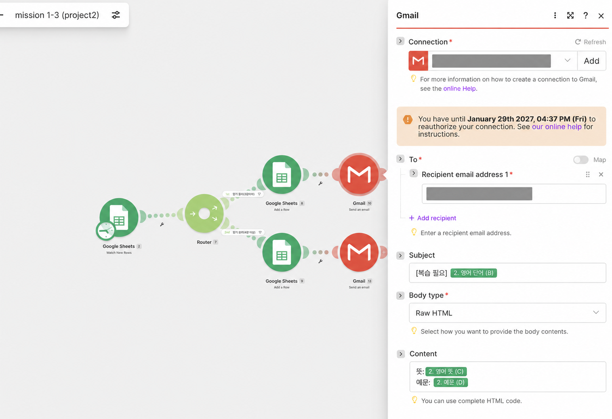
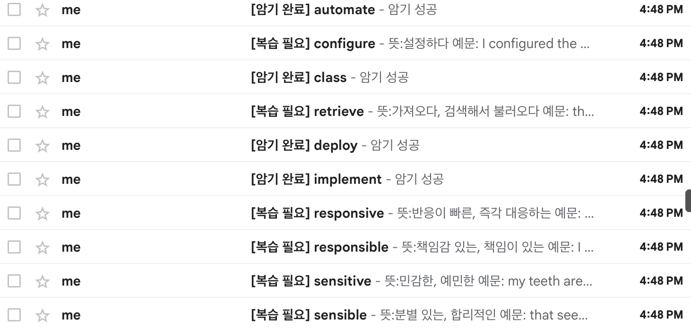

# 프로젝트 2 | 영어 단어 자동 분류 및 이메일 알림

> 사용 도구: **Make**  
> 작성일: 2026-08-02

## 목적

단어의 암기 점수를 매번 확인해 시트로 옮기고 알림을 보내는 반복 업무를 자동화했다.

## 도구 선정 이유

Make는 Router와 실행 흐름이 한눈에 보이고, Google Sheets와 Gmail을 한 시나리오에서 연결하기 쉬워 선택했다.

## 워크플로우

```text
Google Form 제출
→ Google Sheets 새 행 감지(Trigger)
→ 암기 점수 조건 분기(Router/Filter)
   ├─ 1~3점 → '복습 필요' 탭 저장 → 복습 이메일 발송
   └─ 4~5점 → '암기 완료' 탭 저장 → 완료 이메일 발송
```

## 설계 요약

| 구분 | 내용 |
|---|---|
| 입력 데이터 | 타임스탬프, 영어 단어, 뜻, 예문, 암기 점수 |
| Trigger | Google Sheets `Watch New Rows` |
| 처리 | 새 행의 값을 다음 모듈에 매핑 |
| 조건 분기 | 1~3점 / 4~5점 |
| Action | 분기별 시트 행 추가 + Gmail 발송 |
| 결과 확인 | Make 실행 로그, 결과 시트, 수신 이메일 |

## 구현 화면



> 제출용 화면에서는 연결 계정과 수신 이메일 주소를 가렸다.

## 실행 테스트

| 테스트 데이터 | 실행 경로 | 실행 결과 |
|---|---|---|
| `configure` · 3점 | 복습 필요 | 이메일 발송 확인 |
| `automate` · 4점 | 암기 완료 | 이메일 발송 확인 |



## 요구사항 확인

- [x] 반복 업무 정의
- [x] 자동화 도구 선정 및 이유
- [x] Trigger 1개, 조건 분기 1개, Action 2개 이상 구성
- [x] 워크플로우 설명 및 구현 화면
- [x] 1~3점·4~5점 경로 실행 및 이메일 결과 캡처

## 이번 미션에서 알게 된 내용

| 개념 | 알게 된 내용 | 이번 구현 |
|---|---|---|
| Trigger | 자동화를 시작하는 사건 | Google Sheets에 새 행이 생기면 시작 |
| Action | Trigger 이후 실행하는 작업 | 시트에 행 추가, Gmail 발송 |
| Router | 데이터를 여러 경로로 나누는 분기점 | 복습 필요 / 암기 완료 경로 생성 |
| Filter | 각 경로를 통과할 조건 | 1~3점 / 4~5점 여부 판단 |
| 데이터 매핑 | 이전 단계의 값을 다음 단계 입력에 연결 | 단어·뜻·예문을 시트와 이메일에 전달 |

Router는 **길을 여러 개로 나누고**, Filter는 **각 길로 들어갈 수 있는지 검사한다**. Java의 `if/else`와 비슷하며, Make에서는 Router 뒤의 각 연결선에 Filter 조건을 설정했다. Zapier의 Paths는 경로 생성과 조건 설정을 한 구조 안에서 처리한다.

또한 워크플로우가 구성되었다는 것만으로는 충분하지 않고, 경계값인 3점과 4점을 실제로 입력해 모든 분기가 실행되는지 확인해야 한다는 점을 배웠다.

## 결론

점수 입력 이후의 **분류·저장·알림**을 자동화해 수작업 확인을 줄였다.
